# Time Series Clustering Analysis

## Introduction

This project explores different time series clustering techniques using the Trace dataset from the tslearn library. The analysis compares multiple clustering methods to identify patterns and group similar time series together, providing insights into their relative strengths and performance characteristics.

### Dataset

The Trace dataset contains synthetic time series data with known class labels. Each time series represents a different pattern trace, making it an excellent benchmark for evaluating clustering algorithms.

### Methods Implemented

This analysis implements and compares four distinct clustering approaches:

1. **DTW K-means**: Uses Dynamic Time Warping distance to account for temporal shifts in patterns
2. **Hierarchical Clustering with DTW**: Creates a dendrogram showing nested relationships between time series
3. **KShape**: Scale and shift invariant clustering that focuses on shape-based similarities
4. **DBSCAN with DTW**: Density-based clustering that can identify clusters of varying shapes and densities, as well as detect outliers

## Visualizations

### Original Data by Class

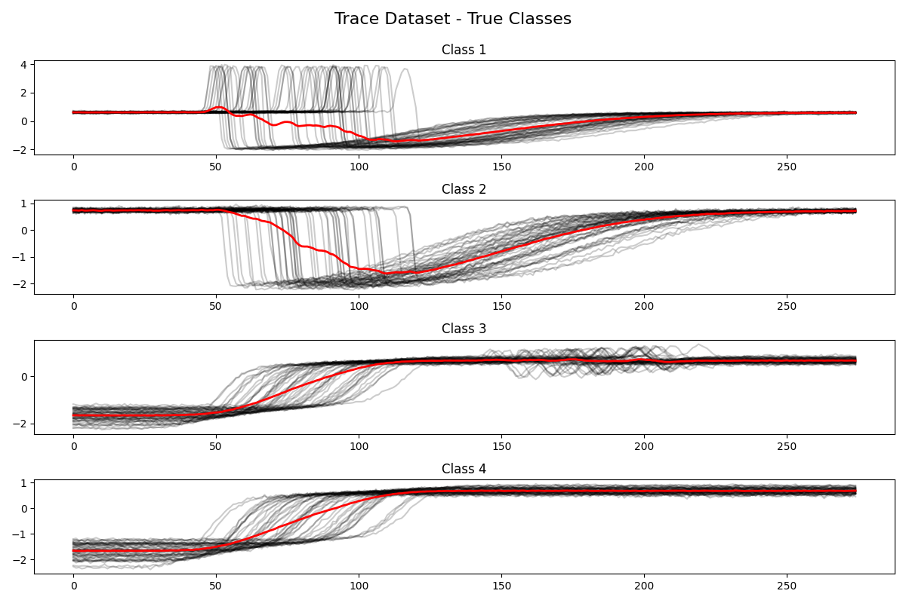
*Time series grouped by their true class labels. Each class displays distinct pattern characteristics.*

### DTW K-means Clustering Results

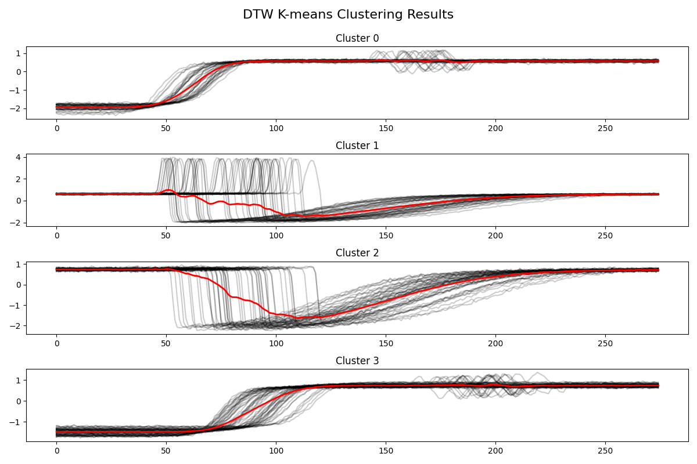
*Results of the DTW K-means clustering algorithm. The plot shows the time series grouped by their assigned clusters.*

### Hierarchical Clustering Results

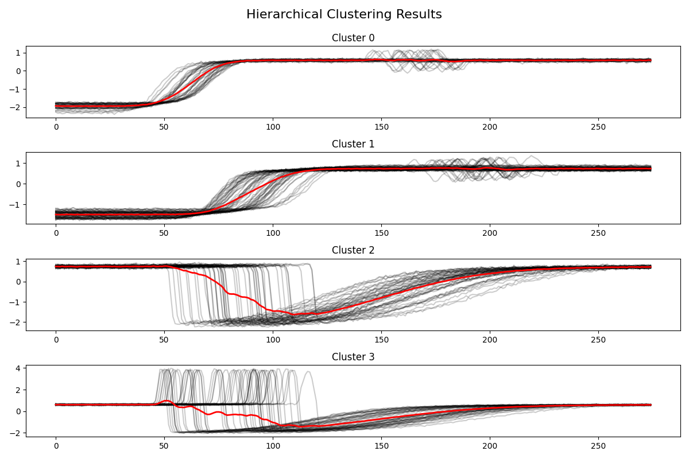
*Results of the hierarchical clustering algorithm using DTW distance. The dendrogram structure reveals nested relationships between patterns.*

### Hierarchical Clustering Dendrogram

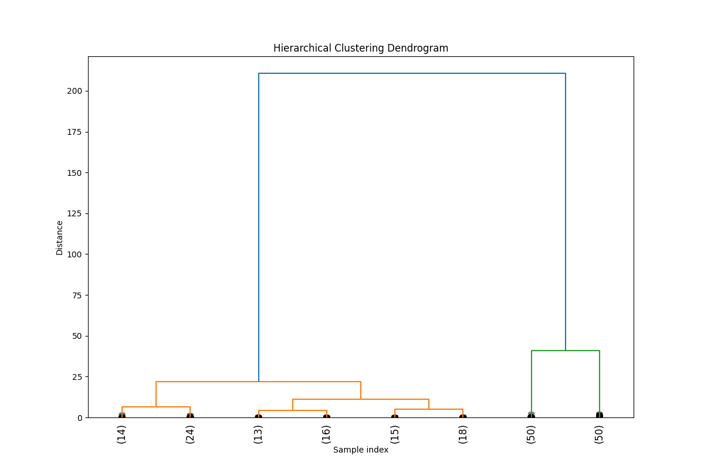
*Dendrogram visualization showing the hierarchical structure of the clusters. The vertical axis represents the distance or dissimilarity between clusters.*

### KShape Clustering Results

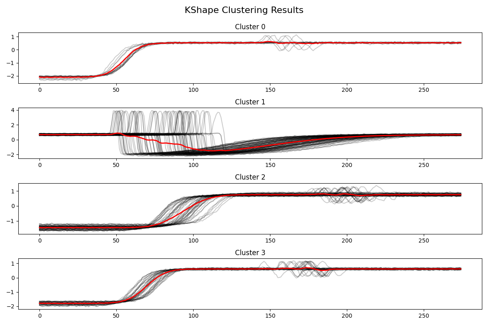
*Results of the KShape clustering algorithm, which focuses on shape-based similarities regardless of amplitude or timing.*

### DBSCAN Clustering Results

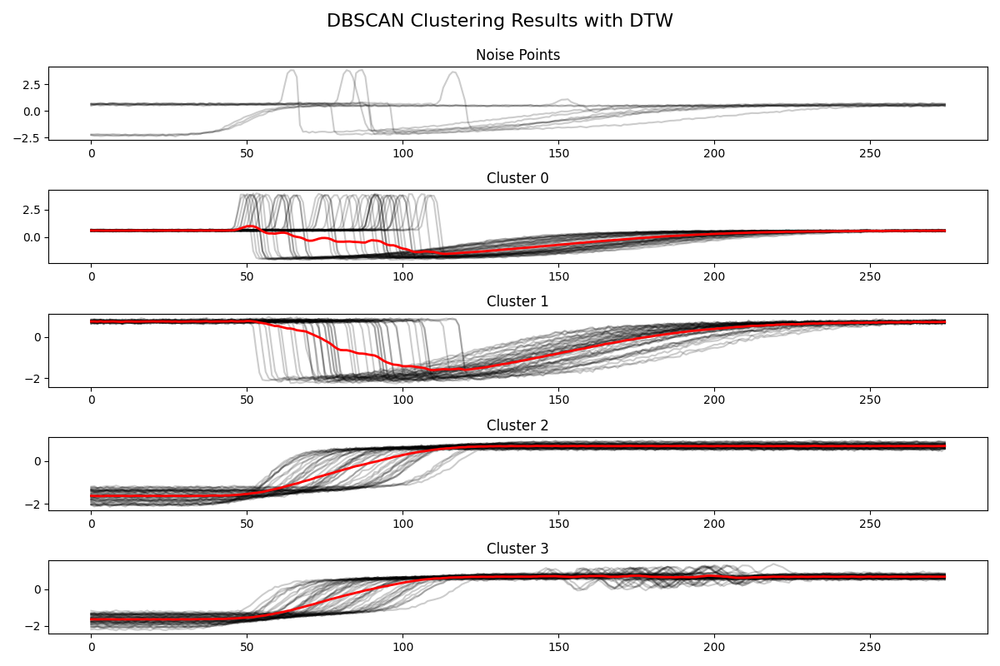
*Results of the DBSCAN clustering algorithm using DTW distance. DBSCAN can identify noise points (outliers) and find clusters of varying densities and shapes.*

### DBSCAN Parameter Selection

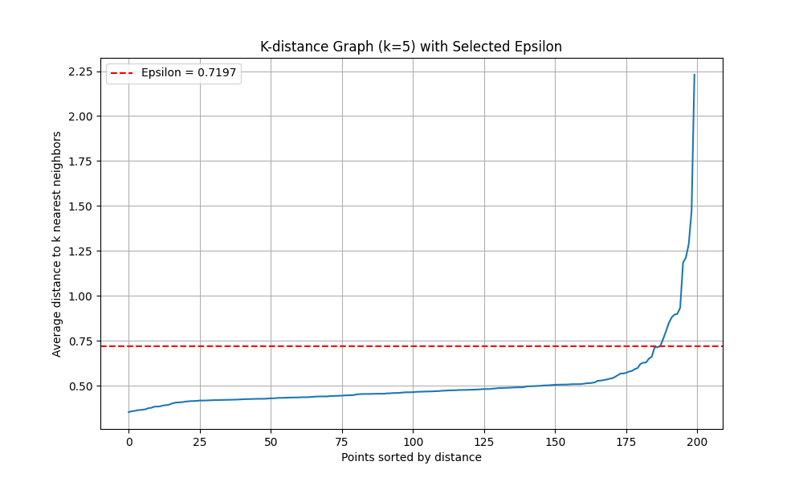
*K-distance graph used to determine an appropriate epsilon parameter for DBSCAN clustering. Visualization of the selected epsilon value based on the elbow/knee point in the k-distance graph.*

### Method Comparison

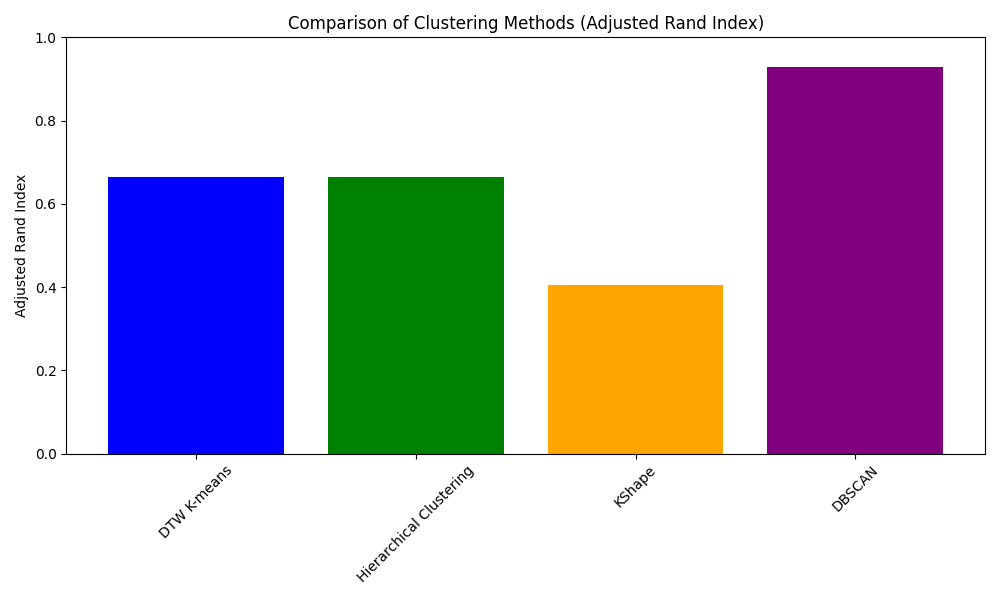
*Bar chart comparing the performance of different clustering methods using Adjusted Rand Index (ARI), which measures the similarity between true class labels and predicted clusters.*

### Confusion Matrices

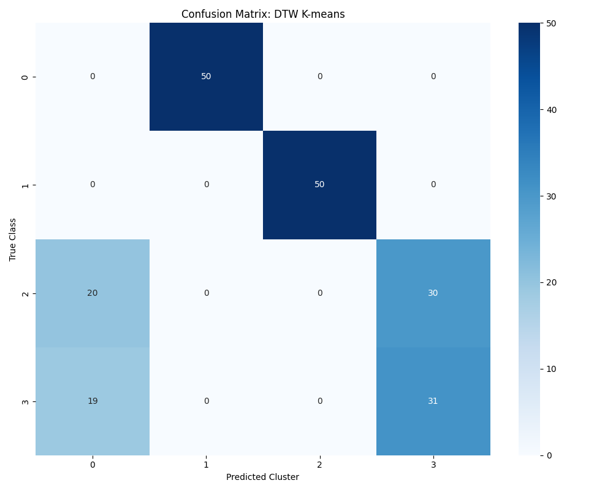
*Confusion matrix for DTW K-means clustering, showing the relationship between true classes and predicted clusters.*

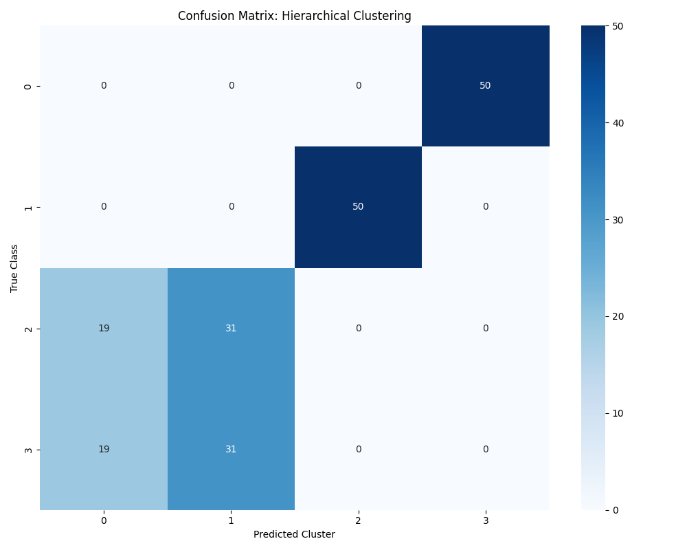
*Confusion matrix for hierarchical clustering, showing the relationship between true classes and predicted clusters.*

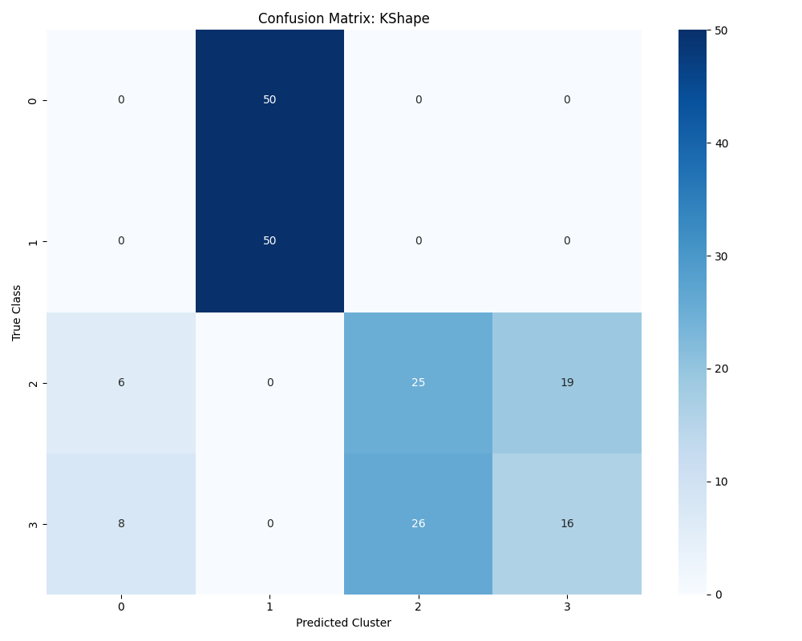
*Confusion matrix for KShape clustering, showing the relationship between true classes and predicted clusters.*

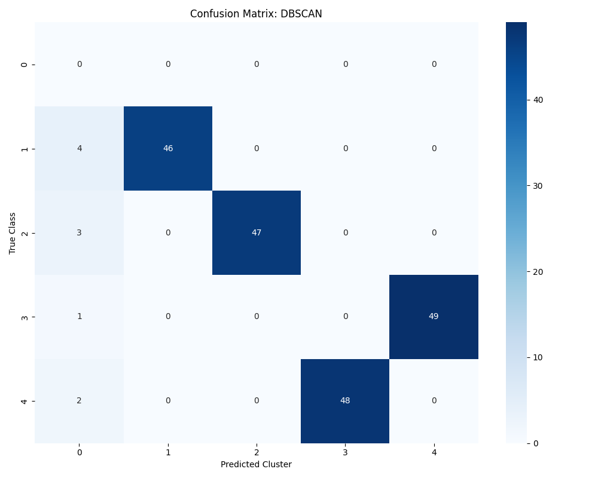
*Confusion matrix for DBSCAN clustering, showing the relationship between true classes and predicted clusters (if DBSCAN found meaningful clusters).*

## Summary and Insights

### Performance Comparison

The clustering methods were evaluated using the Adjusted Rand Index (ARI), which measures the similarity between the true class labels and the predicted clusters. A higher ARI indicates better alignment with the ground truth.

| Method | Adjusted Rand Index | Silhouette Score |
|--------|-------------------|-----------------|
| DTW K-means | 0.6645 | 0.6773 |
| Hierarchical Clustering | 0.6649 | 0.6767 |
| KShape | 0.4061 | - |
| DBSCAN | 0.9295 | - |

### Model Performance Analysis

#### Best Performing Model: DBSCAN
DBSCAN significantly outperformed all other methods with an impressive ARI score of 0.9295, indicating nearly 93% agreement with the true class labels. This exceptional performance suggests that:
- The Trace dataset contains naturally separated clusters with varying densities
- The noise detection capability of DBSCAN effectively isolated outliers
- The automatic parameter selection for epsilon was highly effective
- Density-based approaches are particularly well-suited for this type of time series data

#### Good Performers: DTW K-means and Hierarchical Clustering
Both DTW K-means and Hierarchical Clustering achieved very similar performance with ARI scores around 0.66 and comparable silhouette scores (0.67). This indicates:
- The DTW distance metric works well for capturing temporal similarities in this dataset
- Both centroid-based and hierarchical approaches can identify meaningful structures
- The similar performance suggests these methods are capturing the same fundamental patterns

#### Underperforming Model: KShape
KShape significantly underperformed compared to the other methods with an ARI of only 0.4061, suggesting:
- Shape-based similarity alone may not be sufficient for this particular dataset
- The patterns in the Trace dataset may rely more on amplitude and timing than pure shape
- KShape's normalization approach might obscure important distinguishing features
- While KShape has shown promise in other time series applications, it appears less suitable for this specific dataset

### Key Insights

1. **Algorithm Selection Matters**: The dramatic difference between DBSCAN's performance (0.93) and KShape's performance (0.41) highlights how critical algorithm selection is for time series clustering tasks.

2. **DTW Distance Effectiveness**: The strong performance of all methods using DTW distance (DBSCAN, K-means, Hierarchical) confirms that accounting for temporal elasticity is crucial for this dataset.

3. **Density-Based Advantage**: DBSCAN's superior performance demonstrates that understanding the density structure of time series data provides a significant advantage in clustering accuracy.

4. **Similar Centroid vs. Hierarchical Performance**: The nearly identical performance of DTW K-means and Hierarchical Clustering suggests that the underlying cluster structure is relatively well-defined and can be captured by both approaches.

5. **Shape vs. Full Pattern**: KShape's weaker performance indicates that shape similarity alone, without considering magnitude and exact timing, may lose important discriminative information for this dataset.


## Usage

To reproduce this analysis:

```python
# Install required libraries
pip install numpy matplotlib sklearn tslearn pandas scipy kneed seaborn

# Run the clustering analysis
python time_series_clustering.py
```
